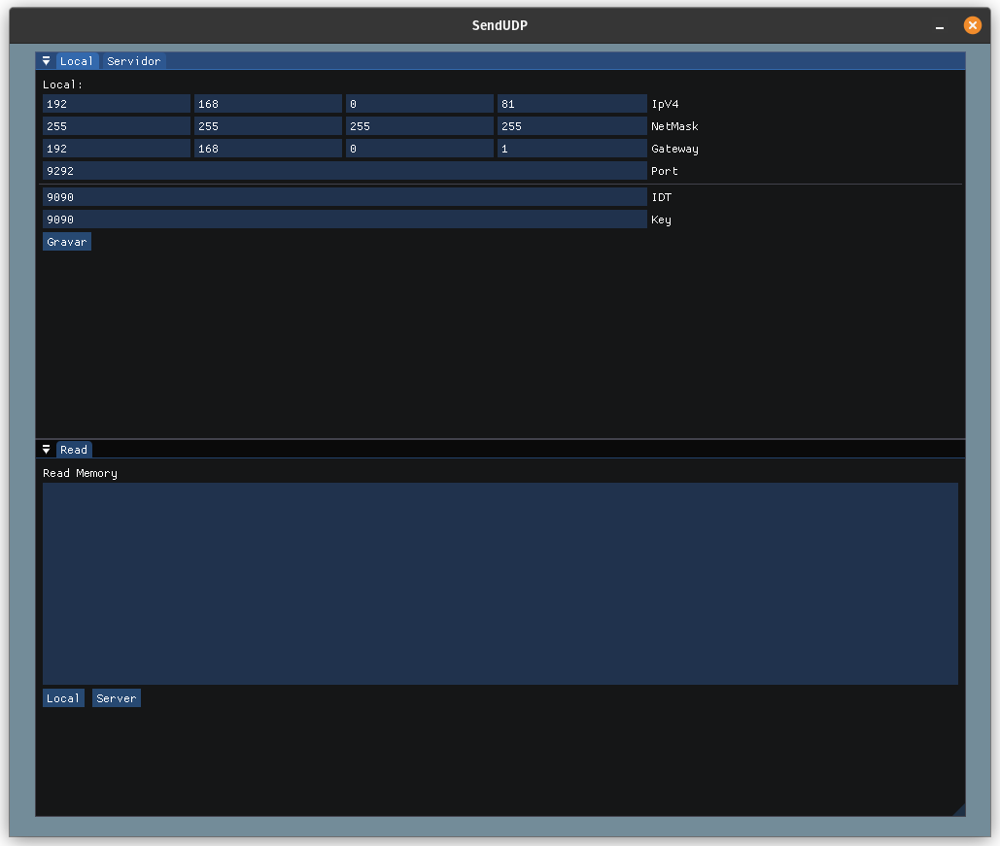
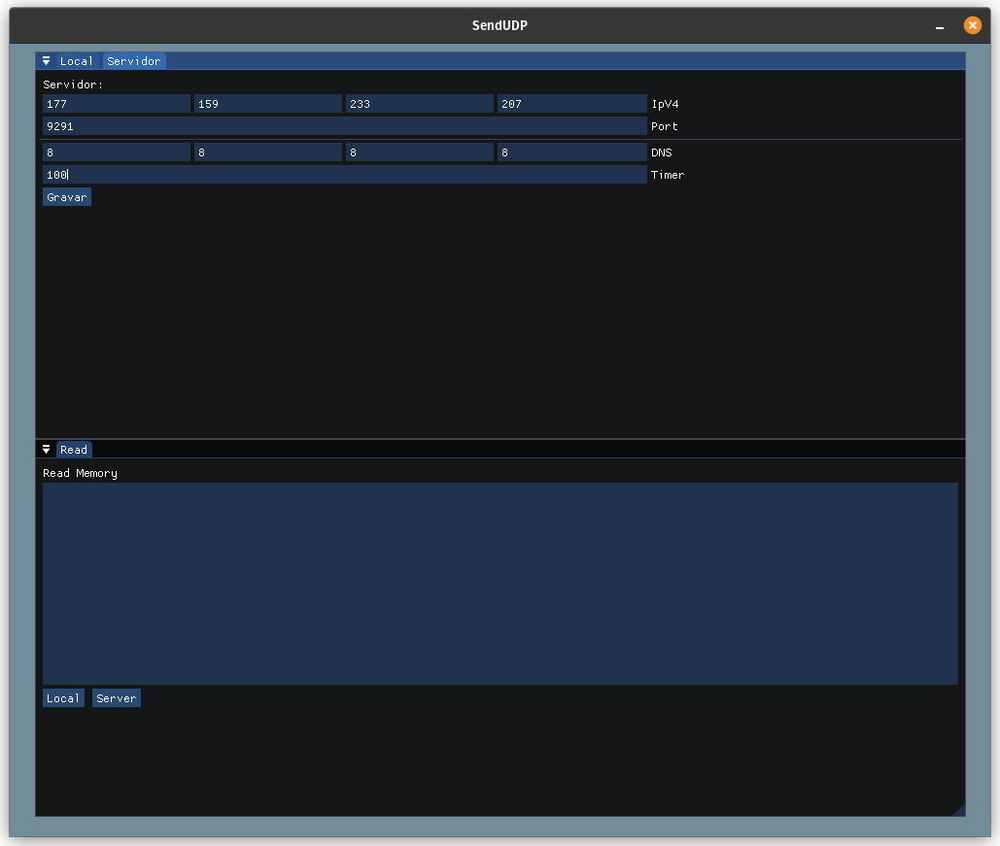

<h1 align="center">
  
    <br>
    SendUDP
</h1>
<p>App to Send specific udp packets to a nobreak.</p>

<h1 align="center">
  
    <br>
</h1>

<h1 align="center">
  
    <br>
</h1>

## Prerequisites :
- PC linux.
- Build Essentials
- ImGui

```
cd src
```
```
make
```

<br>
its it :)

 <br>
 by Popovicz. ͡•_ゝ ͡•
